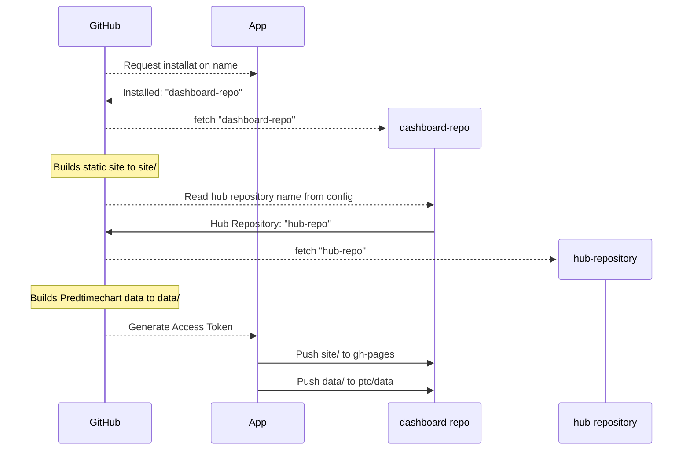

## predtimechart dashboard website builder

This repository contains a test for generating a static website dashboard for
[hubverse hubs](https://hubverse.io). The goal of this exercise is to provide a
service for hub administrators so they can set up a website with minimal effort,
and---importantly---no management of github workflows. 

> [!NOTE]
> This README is evolving as I thrash around with the code. I am writing what I
> hope will be the process, but I am leaving it intentionally vague and will add
> notes where things have not yet been implemented.

## Example

I have created an example repository where I have a folder structure that
contains two YAML configuration files and a folder called `pages/` that 
contains markdown documents and assets (images). It has the
[test-hub-dash-deployer](https://github.com/apps/test-hub-dash-deployer/installations/new)
app installed on it. 

- Hub: [hubverse-org/example-complex-forecast-hub](https://github.com/hubverse-org/example-complex-forecast-hub)
- Dashboard Repository: [zkamvar/test-rotary-phone-turbo](https://github.com/zkamvar/test-rotary-phone-turbo)
- Forecasts: [https://zkamvar.github.io/test-rotary-phone-turbo/forecasts.html](https://zkamvar.github.io/test-rotary-phone-turbo/forecast.html?as_of=2023-01-14&interval=95%25&target_var=wk+inc+flu+hosp&xaxis_range=2023-01-12&xaxis_range=2023-02-05&yaxis_range=-149.47282608695673&yaxis_range=21940.472826086956&model=Flusight-baseline&model=MOBS-GLEAM_FLUH&model=PSI-DICE&location=US)

Every day, this repository builds the forecasts from the hub and the website
from the dashboard repository and uses the app to publish the site. 


## Setup (for hub admins)

The steps to set up a website:

 1. Make a copy of the dashboard template https://github.com/zkamvar/test-rotary-phone-turbo **(template not yet created)**.
    This is known as the **Dashboard Repository**
 2. Modify the markdown files to your liking
 3. **(NOTE: needs screenshots)** Install the [test-hub-dash-deployer](https://github.com/apps/test-hub-dash-deployer/installations/new) on the dashboard repository
    1. "Where do you want to install Test Hub Dash Deployer?": select the organisation that your new dashboard repository was created in
    2. select "Only select repositories" and search for the dashboard repository in the dropdown
    3. click "Install and Request"

That's it. Your website should update in a few minutes **(not yet implemented, this workflow still runs manually)**

Prior Art: https://respicast.ecdc.europa.eu/forecasts/
Repo: https://github.com/european-modelling-hubs/covid19-forecast-hub-europe-website

## Requirements

To successfully run a workflow, you will need to following technologies:

 - Git
 - Docker to build the static site (uses [quarto](https://quarto.org) under the hood)
 - Python (>=3.10) to build the predtimechart data (uses
   [hub-dashboard-predtimechart](https://github.com/hubverse-org/hub-dashboard-predtimechart)
   to build the data)
 - BASH to orchestrate branch creation, pushing, and pulling


## Process

There are two components to the website: the static site dashboard and the JSON
data for predtimechart. These components are built separately and then pushed
to orphan branches in the dashboard repo. When the static site loads, the data
from the data branch is loaded and used for the visualization.

And yes, I can see you squinting at the above sentence and wondering, "How the
heck does this get built without needing to manage GitHub workflows?"
It does so through the magick of a GitHub app. 

When an admin adds the
[test-hub-dash-deployer](https://github.com/apps/test-hub-dash-deployer/installations/new)
on the dashboard repository, they give the app permission to write contents to
that repository. 

In _this_ repository, I have stored the App ID and its PEM key as secrets that
are only accessible as environment variables in scope of a particular job or 
step of the GitHub workflow. This allows the app to generate a temporary access
token that can be used to add content to any repostiory the app is installed on.

The workflow then looks like this for each repository 
(note the build processes are in parallel):



In the two sections below, I detail the general implementations

### Predtimechart data

The general steps to generate the data for predtimechart are:

1. install 
   [hub-dashboard-predtimechart](https://github.com/hubverse-org/hub-dashboard-predtimechart)
   via
   ```bash
   pip install --upgrade pip
   pip install git+https://github.com/hubverse-org/hub-dashboard-predtimechart
   ```
2. clone the dashboard repository and enter it (you only need the `predtimechart-config.yml`)
3. clone the hub repository into `repo/`
4. Generate the Predtimechart data
   ```bash
   mkdir -p data
   hub_predtimechart repo predtimechart-config.yml data/predtimechart-options.json data
   ```
5. enter `repo/` and checkout the `ptc/data` branch
6. copy the contents of `../data` to your current folder
7. add, commit, and push


### Static Site

The static site is generated via docker command and writes a folder called 
`_site/` under the `pages/` folder of the dashboard repository. You need to then
copy the contents of `_site/` into the `gh-pages` branch of the dashboard
repository. 


1. clone the dashboard repository
2. Run the container:
   ```bash
   $ docker run \
     --platform=linux/amd64 \
     --rm \
     --ti \
     -v "/path/to/dashboard/repo":"/site" \
     ghcr.io/zkamvar/test-docker-site:latest \
     bash render.sh \
       ${dashboard repo org} \
       ${dashboard repo name} \
       "ptc/data"
   ```
3. clone the gh-pages branch of the dashboard repository into `pages/`
4. copy the files from the `dashboard repo/site/pages/_site/` folder into `pages/`
5. push the `pages/` folder up. 


## Tools


### Docker

I want to avoid vendor lock-in, so ironically, I am using Docker (which is in and of itself a vendor).
This docker container is built on the Ubuntu image with quarto.

#### To build the docker container

```sh
docker build --platform=linux/amd64 --tag corefast:latest.
```

To run:

```sh
$ docker run \
  --platform=linux/amd64 \
  --rm \
  --ti \
  -v "$(pwd)":"/site" \
  corefast:latest \
  bash render.sh
```

You will have a new folder called `_site/`in your working directory, which will
contain the rendered dashboard website.

### GitHub Workflow helpers

The idea behind the GitHub workflow is to have a GitHub App that is registered
to the individual repositories with markdown. `getInstallations.py` fetches the
names of the repositories that have the app installed and then that gets fed 
into a github job matrix. Each job has an individual token generated (via
`getToken.py`) so that the built website can be pushed to the github pages
branch. 

### Website Builder

We will build the website using [quarto](https://quarto.org), as it is one of the most flexible formats for generating static sites.

The idea for this is to have a ready-made template where we can drop in markdown files and get a website out the other end. 

The template for the website lives in `static/`, which contains a quarto project with the following structure

```
static
├── _quarto.yml
├── forecast.qmd
└── resources
    ├── blank.html
    ├── css
    │   └── styles.css
    ├── header.html
    └── predtimechart.js
```

 - `_quarto.yml` is the quarto configuration file
 - `forecast.qmd` is a quarto markdown file that loads the predtimechart script in the header and has a single `#forecastVis_row` that gets replaced on load.
 - `resources/` is a folder that contains the HTML, JavaScript, and CSS for the website style and function (cribbed from european-modelling-hubs website).

> [!NOTE]
> Predtimechart assumes bootstrap 3, but Quarto uses bootstrap 5 with
> a grid system instead of the box model. I have added a couple of JS lines
> to account for that and update the relevant boxes.


